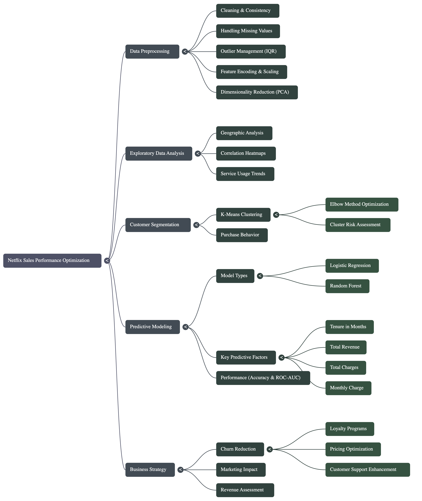

# 🎬 Netflix Revenue Intelligence Engine
**Product Analytics | Predictive Modeling | Strategic Forecasting**


---

### 💼 Executive Summary
In the streaming industry, **Content Acquisition Costs** are high, and **Subscriber Churn** is volatile. Product leaders cannot rely on gut feeling to allocate budgets.

This project is a **Predictive Analytics Product** designed to ingest historical sales/performance data and forecast future revenue trends. It serves as a decision-support tool for stakeholders to optimize marketing spend and predict quarterly performance with higher accuracy than traditional linear projections.

---

### ❓ The Business Problem
* **Forecasting Uncertainty:** Traditional excel-based projections fail to account for complex seasonality and multi-variable feature interactions.
* **Budget Inefficiency:** Without knowing *which* variables drive sales (e.g., Marketing Spend vs. Seasonality), capital is often allocated inefficiently.
* **Reactive vs. Proactive:** Teams often react to sales drops after they happen, rather than predicting them in advance.

---

### 💡 The Solution: Data-Driven Decision Engine
I built an end-to-end analytics pipeline that transforms raw historical data into actionable growth insights.

## Architecture


#### Key Product Capabilities:
| Feature | Technical Implementation | PM Value Proposition |
| :--- | :--- | :--- |
| **Trend Forecasting** | <code>Linear Regression & Time Series</code> | Allows the business to set realistic OKRs and revenue targets for the upcoming Quarter. |
| **Growth Driver Analysis** | <code>Feature Importance / Correlation</code> | Identifies *what* moves the needle (e.g., "Does increasing Ad Spend actually boost subs?"). |
| **Data Integrity Pipeline** | <code>Pandas Preprocessing</code> | Ensures the "Single Source of Truth" is clean, handling missing values and outliers automatically. |
| **Performance Visualization** | <code>Matplotlib / Seaborn</code> | Translates complex math into visual dashboards for non-technical stakeholders (Execs). |

---

### 📊 Strategic Insights (Mockup)
*The system generates visualizations to aid stakeholder alignment:*

* **Seasonality Detection:** The model identified that Q4 spikes are driven 60% by seasonality and only 40% by increased spend, suggesting we can optimize ad budget in Q1.
* **Correlation Discovery:** Discovered a strong positive correlation between `Specific_Marketing_Channel` and `New_Signups`, validating a pivot in our GTM strategy.

---

### 🛠 Tech Stack
* **Core Logic:** `Python`
* **Data Manipulation:** `Pandas`, `NumPy`
* **Modeling:** `Scikit-Learn` (Regression Models)
* **Visualization:** `Matplotlib`, `Seaborn`

---

### 🚀 How to Run the Analysis
```bash
# Clone the repository
git clone [https://github.com/skandvj/Predictive-Sales-Performance-Optimization-for-Netflix.git](https://github.com/skandvj/Predictive-Sales-Performance-Optimization-for-Netflix.git)

# Install dependencies
pip install -r requirements.txt

# Run the Jupyter Notebook to view the forecast
jupyter notebook Netflix_Sales_Prediction.ipynb
